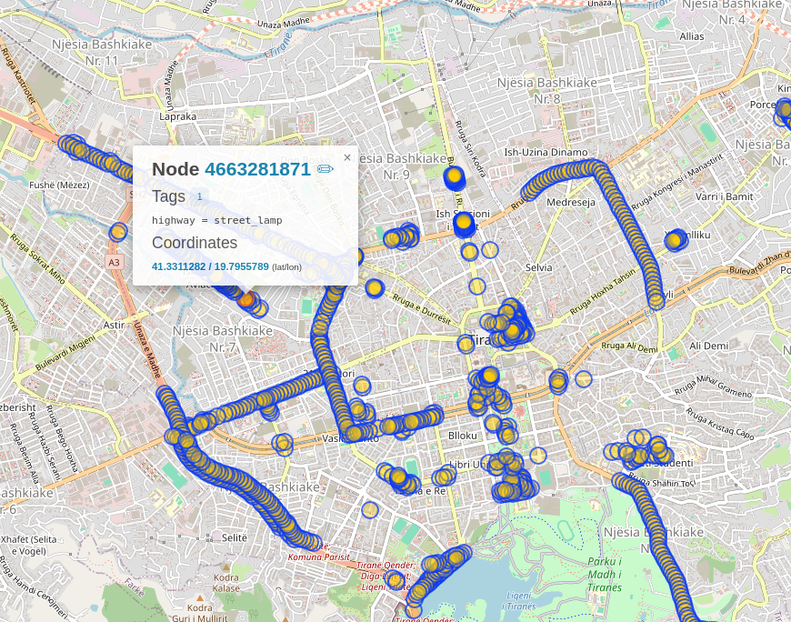

# A mobility portrait

A mobility portrait based on OpenStreetMap (OSM) can provide a detailed and dynamic overview of urban transportation infrastructures, such as public transport routes, cycling lanes, and pedestrian pathways. Leveraging OSM's comprehensive and regularly updated dataset allows for accurate mapping and analysis of transit options, enhancing city planning and user navigation. Moreover, OSM's open-source nature encourages community contributions, ensuring the data remains diverse and up-to-date, which is crucial for maintaining an accurate mobility portrait of a city.

## Public Transport

For public transport, the backbone of data revolves around timetables, routes, fare information, and real-time location of services. Data covering accessibility features and multimodal connectivity can further enrich the user experience and accessibility.


`````{tab-set}
````{tab-item} PT Routes

```
[out:json][timeout:50];
area["name"="Tiranë"]->.searchArea;
(
  relation["type"="route"]["route"="bus"](area.searchArea);
);
out body; >; out skel qt;
```


*Fig. Bus routes in Tirana, based on overpass-api and OSM.*
````


````{tab-item} Bus Stop

```
[out:json][timeout:50];
area["name"="Tiranë"]->.searchArea;
(
  node["highway"="bus_stop"](area.searchArea);
);
out body; >; out skel qt;
```

*Fig. Bus stops in Tirana, based on overpass-api.*

````

````{tab-item} Benches in bus stops?

```
[out:json][timeout:50];
area["name"="Tiranë"]->.searchArea;
(
  node["highway"="bus_stop"](area.searchArea);
);
out body;
out body qt;
{{style:
  node[bench=yes] { color:green; fill-color:green; }
  node[bench=no], node[!bench] { color:red; fill-color:red; }
}}
```


*Fig. Which bus stops have benches in Tirana? Accessibility made easy.*
````

````{tab-item} Data Standards

Data standards like the General Transit Feed Specification (GTFS) are pivotal, allowing for the integration of transit data into navigation tools accessible by the public. Enhancements such as GTFS-Realtime supplement basic service information with live updates, crucial for dynamic scheduling and passenger information systems.

*More information soon ...*
````

`````


## Cycling

Cycling infrastructure data includes details on bike lanes, bike-sharing stations, parking availability, and maintenance facilities. The OpenStreetMap (OSM) platform is a valuable open data source that often includes detailed cycling infrastructure layers. Standardizing this data involves ensuring accurate and current representations of bike paths, designated street lanes, and shared routes.


`````{tab-set}

````{tab-item} Cycling pathways

```
[out:json][timeout:50];
area["name"="Tiranë"]->.searchArea;
(
  way["highway"="cycleway"](area.searchArea);
  way["bicycle"="designated"](area.searchArea);
);
out body;>;out skel qt;
```


*Fig. Cycling pathways in Tirana.*
````


````{tab-item} Designated or not?

```
[out:json][timeout:50];
area["name"="Tiranë"]->.searchArea;
(
  way["highway"="cycleway"](area.searchArea);
  way["bicycle"="designated"](area.searchArea);
);
out body;>;out skel qt;
{{style:
  way[highway=cycleway] { color:blue; width:3; }
  way[bicycle=designated] { color:purple; width:3; }
}}
```

*Fig. Are the cycling paths designated?*

````

````{tab-item} Bicycle parking

```
[out:json][timeout:50];
area["name"="Tiranë"]->.cityArea;
(
  nwr["amenity"="bicycle_parking"](area.cityArea);  
);
out body;>;out skel qt;
{{style:
  node[bicycle_parking=stands] { color:green;  }
  node[bicycle_parking=wall_loops] { color:red; }
  node[traffic_calming=loops] { color:black; }
}}
```


*Fig. Bicycle parking in Tirana.*
````


````{tab-item} Data Standards

Integrating data from bike-sharing programs, including real-time availability and station locations using APIs that conform to open data standards, is essential for a comprehensive cycling infrastructure analysis.

Additionally, one can develop GBFS, similar to GTFS for buses. 

*More information soon ...*

````
`````


## Taxi, electric, micromobility

In modern urban environments, mobility extends beyond traditional road infrastructure to embrace innovative transport options. Taxis and micromobility solutions, including bicycles and electric scooters, enhance short-range travel and last-mile connectivity, while electric charging stations support the growing adoption of electric vehicles. These developments collectively facilitate a sustainable transition in urban transport, reducing congestion and urban pollution, and aligning with broader environmental goals.


`````{tab-set}

````{tab-item} Taxi

```
[out:json][timeout:50];
area["name"="Tiranë"]->.cityArea;
(
  nwr["amenity"="taxi"](area.cityArea);  
);
out body;>;out skel qt;
```


*Fig. Taxi stations in Tirana.*
````


````{tab-item} Charging stations

```
[out:json][timeout:50];
area["name"="Tiranë"]->.cityArea;
(
  nwr["amenity"="charging_station"](area.cityArea);
);
out body;>;out skel qt;
{{style:
  node[access=private] { color:green; width:3; }
  node[access=yes] { color:purple; width:3; }
}}
```


*Fig. Charging stations in Tirana.*
````


````{tab-item} Micromobility


*More information soon ...*

````

````{tab-item} Data Standards

*More information soon ...*

````
`````


## Walking

Data for walking focuses on pedestrian pathways, crosswalks, sidewalk widths, obstacles, and points of interest like public benches, fountains, or shade-providing trees. 


`````{tab-set}
````{tab-item} Sidewalk

```
[out:json][timeout:50];
area["name"="Tiranë"]->.searchArea;
(
  way["highway"="footway"](area.searchArea);
  way["highway"="pedestrian"](area.searchArea);
  way["footway"="sidewalk"](area.searchArea);
);
out body; >; out skel qt;
{{style:
  way[highway=footway] { color:black; width:4; }
  way[footway=sidewalk] { color:grey; width:4; }
  node[highway=pedestrian] { color:orange; width:4; }
}}
```


*Fig. Sidewalks and footways in Tirana. As it can be seen, data is missing.*
````


````{tab-item} Crossings

```
[out:json][timeout:50];
area["name"="Tiranë"]->.searchArea;
(
  node["highway"="crossing"](area.searchArea);

);
out body; >; out skel qt;
{{style:
node[crossing_ref=zebra] { color:black; symbol-size:10; }
node[button_operated=no] { color:red; symbol-size:10; }
node[crossing=uncontrolled] { color:green; symbol-size:10; }
}}
```

*Fig. Crossings information.*

````

````{tab-item} Benches and fountains

```
[out:json][timeout:50];
area["name"="Tiranë"]->.searchArea;
(
  node["amenity"="bench"](area.searchArea);
  node["amenity"="fountain"](area.searchArea);
);
out body; >; out skel qt;
{{style:
  node[amenity=bench] { color:darkgreen; symbol-size:10; }
  node[amenity=fountain] { color:red; symbol-size:10; }
}}
```

*Fig. Benches and fountains in Tirana, OSM-based information.*
````


````{tab-item} Trees

```
[out:json][timeout:50];
area["name"="Tiranë"]->.searchArea;
(
  node["natural"="tree"][!"barrier"](area.searchArea);
);
out body; >; out skel qt;
{{style:
node[natural=tree] { color:darkgreen; }
}}
```

*Fig. Trees in Tirana, OSM-based information. Information is missing.*
````

````{tab-item} Data Standards

Standards for pedestrian data are less developed compared to other mobility modes but can include contributions from OpenStreetMap for geographical data and pedestrian-specific annotations. Data standardization here would benefit from universal tags for pedestrian amenities and hazards, enhancing navigation apps' functionality and safety alerts for foot traffic.

*More information soon ...*


````

`````

## Parking

Parking data encompasses locations, capacities, type (e.g., street, garage, reserved for disabilities), pricing, and real-time availability.

`````{tab-set}
````{tab-item} Parking spaces

```
[out:json][timeout:50];
area["name"="Tiranë"]->.searchArea;
(
  node["amenity"="parking"](area.searchArea);
  way["amenity"="parking"](area.searchArea);
  relation["amenity"="parking"](area.searchArea);
);
out body;>;out skel qt;
{{style:
  node[amenity=parking][parking=surface] { color:black; symbol-size:10; }
  node[amenity=parking][parking=multi-storey] { color:blue; symbol-size:10; }
  node[amenity=parking][parking=underground] { color:darkblue; symbol-size:10; }
  node[amenity=parking][disabled=yes] { color:red; symbol-size:10; }
  way[amenity=parking][parking=surface] { color:yellow; width:3; }
  way[amenity=parking][parking=multi-storey] { color:blue; width:3; }
  way[amenity=parking][parking=underground] { color:darkblue; width:3; }
  way[amenity=parking][disabled=yes] { color:red; width:3; }
  relation[amenity=parking][parking=surface] { color:yellow; width:3; }
  relation[amenity=parking][parking=multi-storey] { color:blue; width:3; }
  relation[amenity=parking][parking=underground] { color:darkblue; width:3; }
  relation[amenity=parking][disabled=yes] { color:red; width:3; }
}}
```


*Fig. Parking spaces in Tirana based on type.*
````

````{tab-item} Data Standards

Data standards such as the Alliance for Parking Data Standards (APDS) facilitate the exchange of parking information across different platforms, improving the efficiency of parking management systems and user apps. Integrating this data with urban mobility apps using standardized APIs can significantly ease the search for available parking, reducing congestion and emissions.

*More information soon ...*

````

`````


## Urban Logistics

Urban logistics data involves information about loading zones, delivery windows, vehicle restrictions, and traffic patterns. Effective data management for urban logistics requires standards that address the unique needs of freight operations in city environments. 

`````{tab-set}
````{tab-item} Data Standards

The use of standards like DATEX II, which is designed for road traffic and transport information, can be pivotal. Enhancing these with real-time traffic and regulation data helps optimize delivery routes and schedules, crucial for reducing congestion and improving delivery efficiency.

*More information soon ...*

````
`````


## Road Infrastructure

Road infrastructure is a critical component of urban and regional development, consisting of a hierarchical network of road types designed to optimize traffic flow and ensure accessibility. Main roads or arterials serve as the primary network for high-volume traffic, connecting major urban centers and facilitating efficient long-distance travel. Secondary roads support this by linking smaller towns and residential areas to the main arteries, handling moderate traffic volumes. Service roads provide local access and distribution, often accompanying main roads and allowing entry to individual properties without disrupting major traffic flows. In addition to these established roads, those under construction are crucial for expanding and improving the existing network, addressing the evolving needs of urban growth and transportation.


`````{tab-set}
````{tab-item} Main roads

```
[out:json][timeout:50];
area["name"="Tiranë"]->.cityArea;
(
  nwr["highway"="motorway"](area.cityArea);
  nwr["highway"="trunk"](area.cityArea);
  nwr["highway"="primary"](area.cityArea);
);
out body;>;out skel qt;
```


*Fig. Main roads in Tirana, based on overpass-api and OSM.*
````


````{tab-item} Secondary roads

```
[out:json][timeout:50];
area["name"="Tiranë"]->.cityArea;
(
  nwr["highway"="secondary"](area.cityArea);
  nwr["highway"="tertiary"](area.cityArea);
);
out body;>;out skel qt;
```

*Fig. Secondary roads in Tirana, based on overpass-api.*

````

````{tab-item} Service roads

```
[out:json][timeout:50];
area["name"="Tiranë"]->.cityArea;
(
  nwr["highway"="residential"](area.cityArea);
  nwr["highway"="service"](area.cityArea);
);
out body;>;out skel qt;
```


*Fig. Residential or service roads in Tirana, based on overpass-api.*
````

````{tab-item} Under contruction

```
[out:json][timeout:50];
area["name"="Tiranë"]->.cityArea;
(
  nwr["highway"="construction"]({{bbox}});
);
out body;>;out skel qt;
```


*Fig. Under construction roads in Tirana, based on overpass-api.*
````


````{tab-item} Data Standards

The data standards will be based on country-specific specifications. 

*More information soon ...*
````

`````


## Road Assets

Road assets encompass a wide array of infrastructure components that are essential for the maintenance, safety, and efficiency of transportation networks. These assets include physical elements like roads, bridges, tunnels, and traffic signals, as well as more transient features such as signage, lighting, and roadside barriers. Management of these assets involves detailed planning and deployment of maintenance schedules to ensure their longevity and functionality. 


`````{tab-set}
````{tab-item} Traffic signals

```
[out:json][timeout:50];
area["name"="Tiranë"]->.cityArea;
(
  nwr["crossing"="traffic_signals"](area.cityArea);  
);
out body;>;out skel qt;
```


*Fig. Traffic signals in Tirana, based on overpass-api and OSM.*
````


````{tab-item} Street lamps

```
[out:json][timeout:50];
area["name"="Tiranë"]->.cityArea;
(
  nwr["highway"="street_lamp"](area.cityArea);  
);
out body;>;out skel qt;
```

*Fig. Street lamps in Tirana, based on overpass-api.*

````

````{tab-item} Traffic calming

```
[out:json][timeout:50];
area["name"="Tiranë"]->.cityArea;
(
  nwr[~"^traffic_calming$"~".*"](area.cityArea);
);
out body;>;out skel qt;
{{style:
  node[traffic_calming=bump] { color:green;  }
  node[traffic_calming=hump] { color:pink; }
  node[traffic_calming=island] { color:grey; }
  node[traffic_calming=rumble_strip] { color:red; }
}}
```


*Fig. Traffic calming in Tirana, based on overpass-api.*
````

````{tab-item} ...

*More information soon ...*

````


````{tab-item} Data Standards

The data standards will be based on country-specific specifications. 

*More information soon ...*
````

`````


<br><br>
