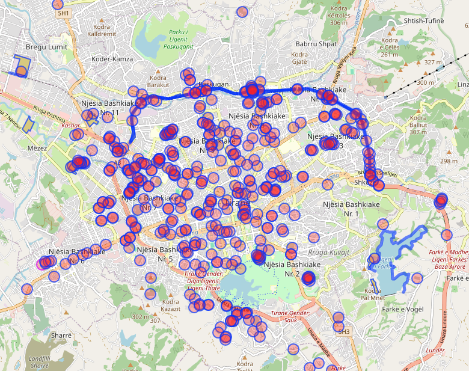

# OpenStreetMap Data

OpenStreetMap (OSM) stands out as a fundamental resource in the realm of transport and infrastructure due to its open data standards and extensive ecosystem. As a collaboratively sourced map that anyone can edit, OSM provides a valuable depth of geographic data globally, which is crucial for movement analytics, planning, and the development of public infrastructure. Using OpenStreetMap (OSM) data for this initiative provides several advantages:


### Why OSM?

::::{grid} 1 1 2 2
:gutter: 3

:::{grid-item-card}
:class-header: bg-light

<b style="color: blue">Open and Free!</b>
^^^

OSM data is freely available for both commercial and non-commercial use. This open access significantly reduces the costs associated with acquiring geographic data and allows the application to scale without the constraint of additional licensing fees.
:::

:::{grid-item-card}
:class-header: bg-light

<b style="color: blue">Community-Driven Updates!</b>
^^^

OSM's data is constantly updated by a global community of contributors. This means the data can be very current, reflecting real-world changes and improvements faster than commercial datasets.
:::
 
:::{grid-item-card} 
:class-header: bg-light

<b style="color: blue">Global Coverage!</b>
^^^

OSM offers comprehensive geographic data with global coverage. This makes it suitable for applications intended to be used in various geographical locations without the need for dealing with multiple data providers.
:::

:::{grid-item-card}
:class-header: bg-light

<b style="color: blue">Rich Data Set!</b>
^^^

OSM provides a rich set of geographical data points, including but not limited to roads, buildings, parks, and rivers. This can be particularly useful for infrastructure projects that require detailed environmental and urban layout information.
:::

::::


<br>


### Download OSM Data

There are several ways to download OSM data for local usage.

- **Geofabrik**: Provides regularly updated OSM data extracts by continent, country, or region. Geofabrik's tools and services help users access and utilize OSM data effectively for their specific needs.

- **Overpass API**: A read-only API that serves up custom selected parts of the OSM map data. It is particularly useful for developers and analysts who need to query specific OSM data efficiently.


```{seealso}
Read more on <b style="color: blue"> [EXPORTING OSM DATA](https://wiki.openstreetmap.org/wiki/Databases_and_data_access_APIs
)</b>.
```


<br>


### Overpass API example

Below its an example on how to use Overpass API.


```
[out:json][timeout:25];
// Query elements with landuse=construction or construction=* within the current map view
(
  node["landuse"="construction"]({{bbox}});
  way["landuse"="construction"]({{bbox}});
  relation["landuse"="construction"]({{bbox}});

  node["construction"]({{bbox}});
  way["construction"]({{bbox}});
  relation["construction"]({{bbox}});
);

// Output the results
out body;
>;
out skel qt;
```
*Example query for extracting all the elements that are under construction through overpass api.*




