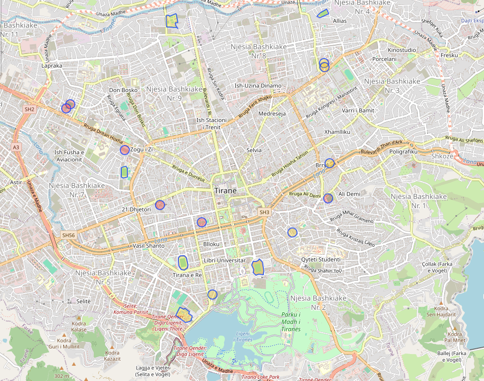

# A city portrait

To truly grasp the essence of a city, one must delve into the several services it offers and their geographical distribution. Understanding where hospitals, schools, police stations, recreational facilities, and other critical services are located can reveal much about the socio-economic priorities and logistical layout of the urban environment.

For instance, the proximity of healthcare and educational facilities to residential areas can indicate a city’s commitment to welfare and accessibility. Conversely, the placement of industrial areas and their relation to living quarters can affect environmental quality and commuting patterns of the populace.

### Main services

The main services within a city, including hospitals, police stations, and educational institutions, significantly impact urban mobility and the daily flow of traffic. The locations of these essential services often dictate public transport routes and road infrastructure development to ensure that they are accessible to all residents. By strategically placing these services, cities can enhance the efficiency of transportation networks, reduce travel times, and promote a more equitable distribution of mobility resources, contributing to a safer and more connected urban environment.

`````{tab-set}
````{tab-item} Hospital

```
[out:json][timeout:25];
(
  nwr["building"="hospital"]({{bbox}});
  nwr["amenity"="hospital"]({{bbox}});

  nwr["building"="clinic"]({{bbox}});
  nwr["amenity"="clinic"]({{bbox}});

  nwr["building"="doctors"]({{bbox}});
  nwr["amenity"="doctors"]({{bbox}});
);
out body;>;out skel qt;
```


*Fig. Hospitals in Tirana, based on overpass-api.*
````


````{tab-item} Police

```
[out:json][timeout:25];
(
  nwr["building"="police"]({{bbox}});
  nwr["amenity"="police"]({{bbox}});
);
out body; >; out skel qt;
```

*Fig. Police in Tirana, based on overpass-api.*

````

````{tab-item} Emergency services

```
[out:json][timeout:25];
(
  nwr["amenity"="fire_station"]({{bbox}});
  nwr["building"="fire_station"]({{bbox}});

  nwr["amenity"="emergency_phone"]({{bbox}});
  nwr["amenity"="emergency_service"]({{bbox}});

  nwr["emergency"="ambulance_station"]({{bbox}});  
);
out body; >; out skel qt;
```


*Fig. Emergency services, like firestation or ambulance station.*
````
`````


<br><br>


### Educational facilities

Educational facilities such as universities, schools, kindergartens, and libraries play a crucial role in a city. They not only offer learning and development opportunities but also significantly impact urban mobility. These institutions attract a large number of people daily, influencing traffic patterns and public transport routes. Cities often prioritize roads and transport services around these facilities to accommodate the influx of students and staff, ensuring easy and safe access. This setup helps reduce congestion and improves the overall flow of city traffic.

`````{tab-set}
````{tab-item} Universities
```
[out:json][timeout:25];
(  
  nwr["amenity"="university"]({{bbox}});
  nwr["amenity"="college"]({{bbox}});
);
out body;>;out skel qt;
```


````

````{tab-item} Schools

```
[out:json][timeout:25];
(
  nwr["amenity"="school"]({{bbox}});
);
out body;>;out skel qt;
```


````


````{tab-item} Kindergartens

```
[out:json][timeout:25];
(
  nwr["amenity"="kindergarten"]({{bbox}});
);
out body;>;out skel qt;
```


````

````{tab-item} Libraries

```
[out:json][timeout:25];
(
  nwr["amenity"="library"]({{bbox}});
);
out body;>;out skel qt;
```


````

`````

<br><br>


### Jobs 

Jobs in industrial sectors and governmental institutions can greatly influence urban mobility patterns. Industrial jobs, often located in specific zones or on the outskirts of cities, can lead to increased traffic flow towards these areas, particularly during shift changes. This concentration of workforce movement necessitates efficient transportation routes and can lead to the development of new roads and public transit services to accommodate the volume. Similarly, governmental jobs, typically centralized in urban centers, draw a significant number of employees into city centers daily, impacting peak traffic hours and public transport usage. Both sectors' employment distributions help shape the transit infrastructure and planning needed to support a city’s commuting demands efficiently.

`````{tab-set}
````{tab-item} Industrial
```
[out:json][timeout:30];
(
  nwr[~"^industrial$"~".*"]({{bbox}});
  nwr["landuse"="industrial"]({{bbox}});
);
out body; >; out skel qt;
```


````

````{tab-item} Governmental Institutions

```
[out:json][timeout:30];
(
  nwr[~"^government$"~".*"]({{bbox}});
);
out body; >; out skel qt;
```


````

`````

<br><br>

### Leisure


Leisure activities, such as visiting parks and gardens, theaters, cinemas, stadiums, and sport centers, significantly influence urban mobility patterns. These destinations tend to attract large numbers of people, especially on weekends and holidays, leading to increased demand for public transport and potentially causing congestion in nearby areas. The strategic placement of leisure facilities can encourage the use of public transportation, cycling, and walking, helping to reduce car use and promote more sustainable mobility options in the city.

`````{tab-set}
````{tab-item} Parks and Gardens
```
[out:json][timeout:50];
area["name"="Tiranë"]->.cityArea;
(
  nwr["leisure"="park"](area.cityArea);
  nwr["leisure"="garden"](area.cityArea);
);
out body;>;out skel qt;

```


````

````{tab-item} Theaters and Cinemas

```
[out:json][timeout:50];
area["name"="Tiranë"]->.cityArea;
(
  nwr["amenity"="theatre"](area.cityArea);
  nwr["amenity"="cinema"](area.cityArea);
  nwr["amenity"="arts_centre"](area.cityArea);
);
out body;>;out skel qt;
```


````


````{tab-item} Stadiums and Sport Centers

```
[out:json][timeout:50];
area["name"="Tiranë"]->.cityArea;
(
  nwr["leisure"="sports_centre"](area.cityArea);
  nwr["leisure"="stadium"](area.cityArea);
);
out body;>;out skel qt;
```


````


````{tab-item} Playgrounds

```
[out:json][timeout:50];
area["name"="Tiranë"]->.cityArea;
(
  nwr["leisure"="playground"](area.cityArea);
);
out body;>;out skel qt;
```


````
`````

<br><br><br>

*More descriptions to come.*
