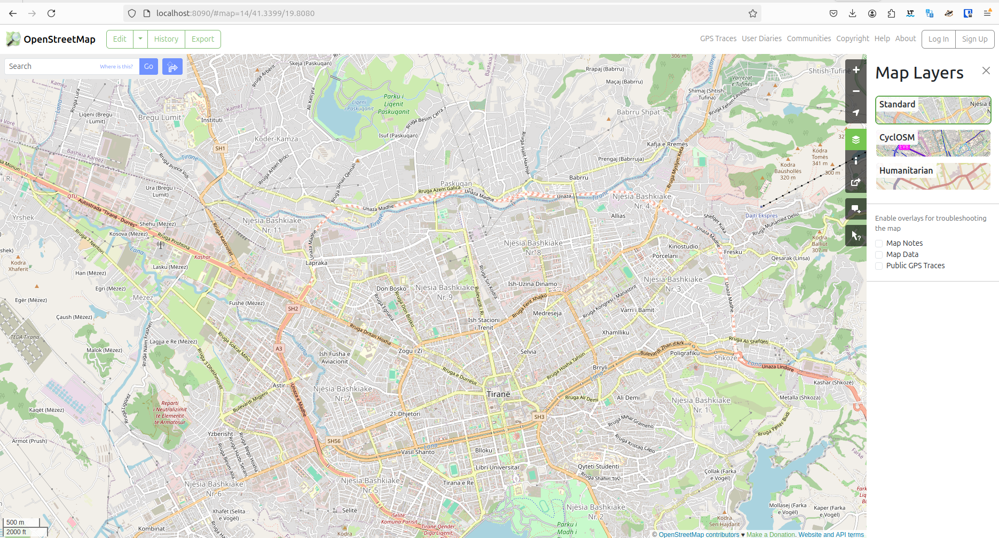
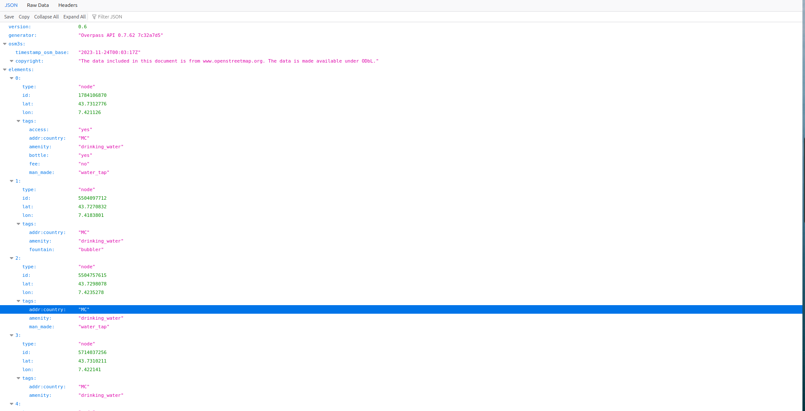

# Related solutions

What if you don't want to host resmi? What can you do to archive the same kind of results?


### Standardize OSM analytics?

Well, resmi is based on OpenStreetMap data, so it's always a great idea to complete OSM dataset and then do some repetitive processing. This is okay in principle, but we are looking for more advanced usesr functionality that is based in a more targeted schema.

Additionally, we want to standardize some tags and expand on those - some things that are country specific. This would be considered vandalism in OSM more than informative stuff.

The question still remains though - what is the suggested way to use OSM as a plug-n-play for expanding the model internally? To be understood during the way.


### Using OSM-Seed?

We have started checking the possibility to use OSM Website for the editing and also include a task manager and overpass for that. The main thing to check in this case is the database schema that might need extension to fulfill the purpose of resmi. That means having asset-types on the side for further configuration, adding some validators.

One consideration, the tool and setup itself is quite heavy, and we plan to add many more functionalities (power functions) to it, so it might become quite difficult in the long run to maintain this "version" of OSM editor and DB. 


- [OSM Seed](https://github.com/developmentseed/osm-seed)
- [Database Schema of OSM](https://wiki.openstreetmap.org/wiki/File:ERD_of_OSM_DB.svg)
- [OSMAlchemy](https://edugit.org/Veripeditus/OSMAlchemy)
- [OSM Website](https://github.com/openstreetmap/openstreetmap-website)
- [OSM Tasking Manager](https://wiki.openstreetmap.org/wiki/Tasking_Manager)
- ...


<br>


`````{tab-set}
````{tab-item} Hosting OSM


*Fig. Example OSM hosted through their docker setup.*
````

````{tab-item} Hosting Overpass


*Fig. Example Overpass hosted through their docker setup.*
````
````{tab-item} Hosting Task Manager

*Example soon.*
````

`````

### Using Public Domain Map?

To be checked how they have extended the tasking manager and the id-editor, and whether the editor can accept the extra stuff that we want to put.

- [Public Domain Map](https://openstreetmap.us/our-work/public-domain-map/)
- [PDM Editor](https://github.com/publicdomainmap/editor)


### Using OSM-NG?

OSM-NG is to be checked, I have not had time to check it yet. Might be a good integration with resmi for the tag customization.

- [OSM-NG](https://github.com/openstreetmap-ng/openstreetmap-ng)
- [Discussion of OSM-NG](https://community.openstreetmap.org/t/the-next-generation-of-openstreetmap-in-python/105621)
- ...


### Using InASafe?

For disaster risk management, InASafe can be quite useful. Will probably integrate its model for Disasters (as mentioned in Why resmi > Second Group of Images > General outline).


- [InASafe](https://inasafe.org/)
- [InASafe Code](https://github.com/inasafe/inasafe)
- [Definitions InASafe](https://github.com/inasafe/inasafe/tree/develop/safe/definitions)
- [Using InASafe](https://manual.inasafe.org/training/qgis/Chapter-08-Using_InaSAFE.html)


### Cycling Infrastructure Prioritization Kit example

> A research project funded by the UK Department for Transport. CyIPT Interface Example CyIPT is a collection of tools aiming to provide an evidence-base for prioritisation of transport infrastructure that will get more people cycling.

- [Cycling Infra](https://www.cyipt.bike/)
- [Manual](https://www.cyipt.bike/manual/technical-details.html)
- [Propensity to Bike](https://www.pct.bike/manual.html)
- [National Propensity to Bike](https://github.com/npct/)


<br><br>

*More info soon.*
