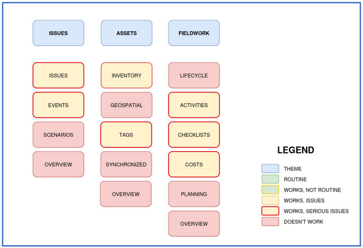
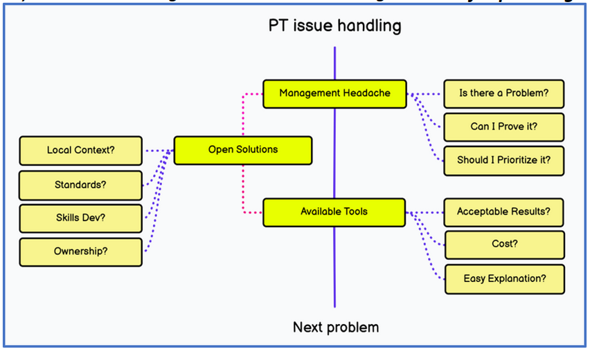
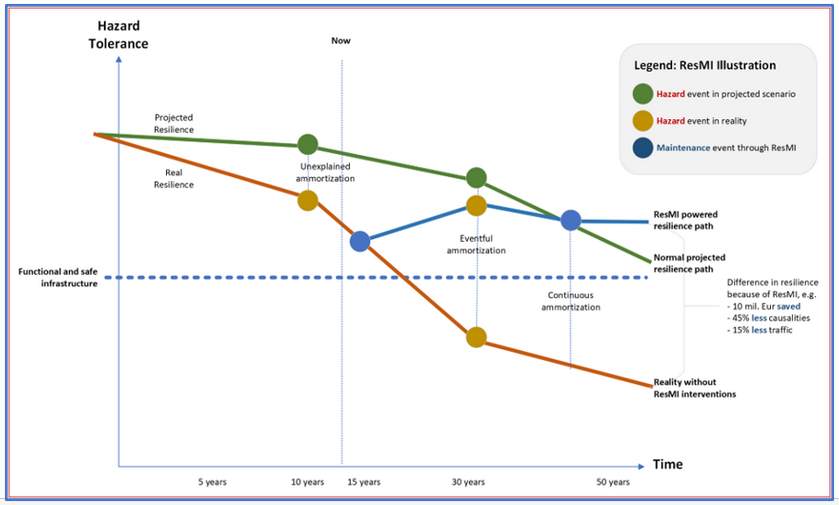
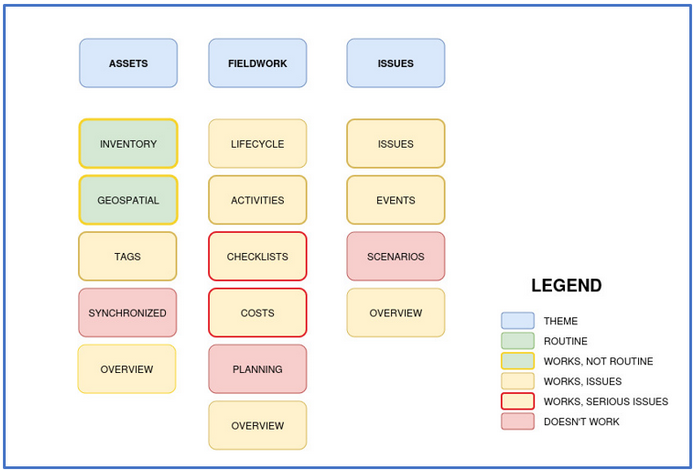
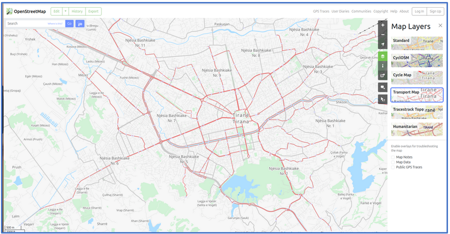

# Why resmi?

There are multiple issues that happen with mobility maintenance that force cities to have a tool that handles managing mobility infrastructure. 

<br><br>

````{tab-set}


```{tab-item} Slow institutions, fast city

<br>

When interacting with institutions, some of them have data and processes, but most are not consistent enough for proactive solutions. **Issues define priorities.​**


<br>
*Fig. Elements of daily work relating to infrastructure are not achieved due to prioritization.*
<br><br>

```

```{tab-item} Fixing infrastructure

<br>

Mobility infrastructure fixes often happens ad-hoc, so it takes time, and often reduces in priority once that management is not overlooking. **No time for planning.​**


<br>
*Fig. How decision-making works in a not-so-efficient institution, and how open initiatives can help.*
<br><br>
```

```{tab-item} Hidden fragility hurts

<br>

Projections on infrastructure status are based on many assumptions, and do not consider events that might reduce quality non-visibly. **Proactive interventions needed.​**


<br>
*Fig. How projected resilience paths are often optimistic, and how intervening can help.*
<br><br>
```
````
<br><br>

````{tab-set}


```{tab-item} Faster practices

<br>

Our target is to help cities improve and plan better mobility interventions through data. This will increase resilience and change attitude on interventions.​
​


<br>
*Fig. Current ambition of resmi, to help with multiple of the processes mentioned above.*
<br><br>
```

```{tab-item} Start with Open Data

<br>

**OpenStreetMap** is a base map that contains standardized info on the infra and services of the city, all crowdsourced from volunteers. Check your city!​

https://www.openstreetmap.org/​



<br>
*Fig. OpenStreetMap on Tirana.*
<br><br>

```

````
