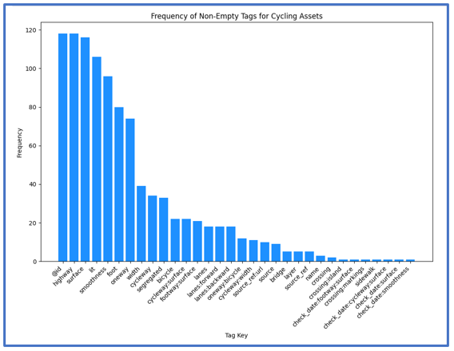
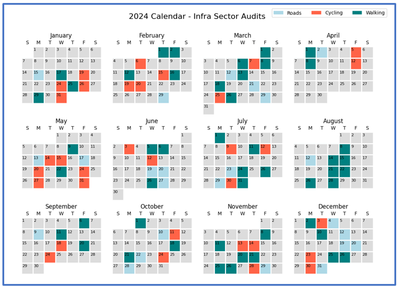
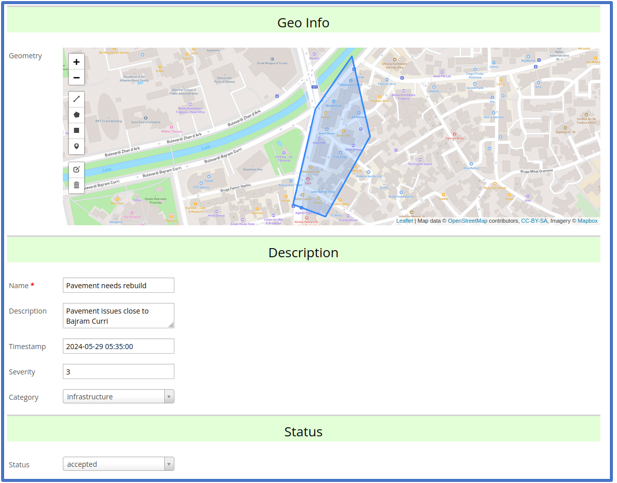
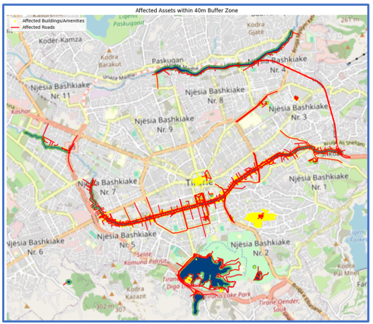
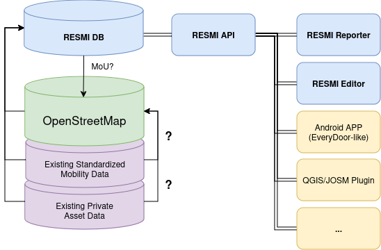
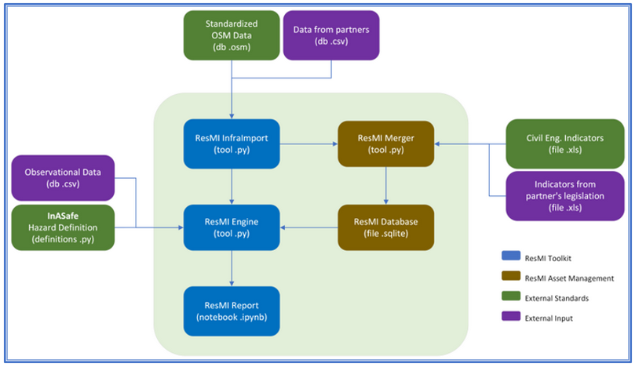

# resmi

resmi (Resilient Mobility Infrastructure) is a tool designed to use open data for the management and maintenance of urban mobility infrastructure.

Utilizing a wide array of data sources and standards (OpenStreetMap, GTFS, GBFS, ...) resmi tries to provide a dynamic and comprehensive overview of transportation networks. By leveraging up-to-date, community-contributed open data, resmi ensures that experts have access to reliable information, aiding in the effective maintenance and enhancement of urban mobility systems. More information in the respective pages.

<br>


### Gallery

````{tab-set}


```{tab-item} Asset inventory

<br>

The data can be used to create informative charts for decision makers. Below can be seen the missing data for cycling segments, or the surface can be mapped.​


<br>
*Fig. The completeness of tags on cycling assets for Tirana.*
<br><br>

```

```{tab-item} Scheduled fieldwork

<br>

When done early in the year, the scheduling can allow better planning. This can be done for each sector, helping prioritization, and **better allocation of budget**.​


<br>
*Fig. An example schedule of the work for the infrastructure section of the transport department of Tirana.*
<br><br>

```
```{tab-item} Report issues

<br>

Reporting of issues can be done directly by mapping area and defining asset type – and then the assets in that area can be marked to be audited. Public later.​


<br>
*Fig. How to democratize reporting of issues.*
<br><br>

```

```{tab-item} Events and scenarios

<br>

In case of historical events, the assets closest to the event need to be extracted and assigned the event. This will be later used for estimations of costs. ​


<br>
*Fig. How mapping of events can automatize long-term impacts on infrastructure.*
<br><br>
```
````

<br>

### Illustrations


````{tab-set}

```{tab-item} Development scope


<br>

<br>
*Fig. An illustration on resmi's planned usage.*
<br><br>
```

```{tab-item} Initial ideation

<br>

<br>
*Fig. An illustration on resmi's initial ideation usage pattern.*
<br><br>
```
````

<br>

### Questions

- How to make use of OpenStreetMap data for resilience?
    - use an OSM proposal?
    - similar to InASafe formats?
- How to create a database for 'private' data that can synchronize with OSM too?
    - the baseline node-way-relation-tag format?
    - the baseline DB should extend existing db - export/import OSM?
- How to integrate 'official' institutions to public domain information?
    - use an OSM Proposal?
    - use an MoU with resmi?


<br><br>

```{tableofcontents}
```
